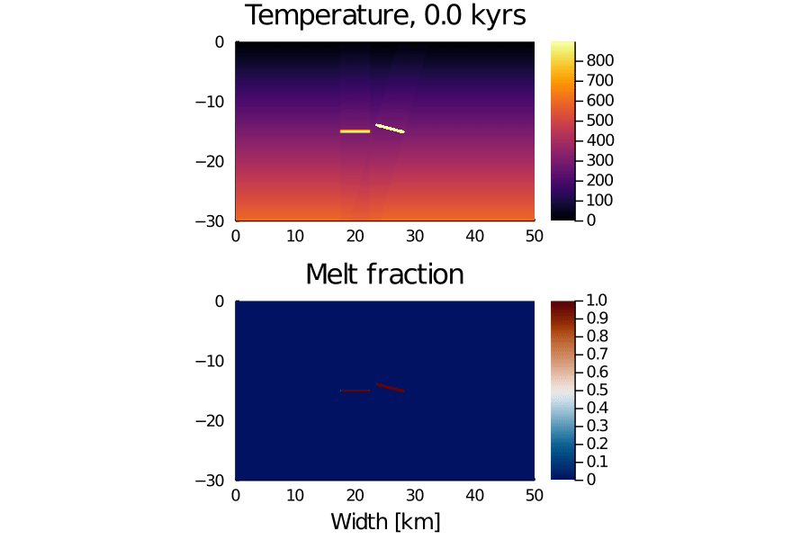
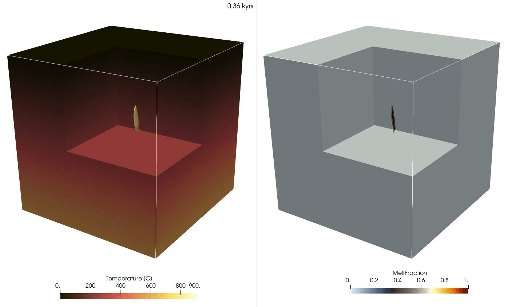

# MagmaThermoKinematics.jl

[](https://github.com/boriskaus/MagmaThermoKinematics.jl/actions)
[](https://zenodo.org/badge/latestdoi/337510164)

Understanding how magmatic systems work is of interest to a wide range of Earth Scientists.

This easy to use and versatile package simulates the thermal evolution of magmatic systems following the intrusion of dikes and sills. It can take 2D, 2D axisymmetric and 3D geometries into account, and works on both parallel CPU's and GPU's. A finite difference discretization is employed for the energy equation, combined with semi-Lagrangian advection and tracers to track the thermal evolution of emplaced magma. Dikes are emplaced kinematically and the host rock is shifted to accommodate space for the intruding dikes/sills, in a number of ways including by using analytical models for penny-shaped cracks in elastic media. Cooling, crystallizing and latent heat effects are taken into account, and the thermal evolution of tracers can be used to simulate zircon age distributions.

Below we give a number of example scripts that show how it can be used to simulate a number of scenarios.

## Contents
  - [100-lines 2D example](#100-lines-2d-example)
  - [100-lines 3D example](#100-lines-3d-example)
  - [Dependencies](#dependencies)
  - [Installation](#installation)

## 100-lines 2D example
A simple example that simulates the emplacement of dikes within the crust over a period of 10'000 years is shown below. 



The code to simulate this, including visualization, is only 100 lines and the key parts of it are shown below
```julia
using MagmaThermoKinematics
const USE_GPU=false;
if USE_GPU  environment!(:gpu, Float64, 2)      # initialize parallel stencil in 2D
else        environment!(:cpu, Float64, 2)      # initialize parallel stencil in 2D
end
using MagmaThermoKinematics.Diffusion2D # to load AFTER calling environment!()
using Plots                                     

#------------------------------------------------------------------------------------------
@views function MainCode_2D();

Nx,Nz                   =   500,500
Grid                    =   CreateGrid(size=(Nx,Nz), extent=(30e3, 30e3)) # grid points & domain size
Num                     =   Numeric_params(verbose=false)                   # Nonlinear solver options

# Set material parameters                                       
MatParam                =   (
        SetMaterialParams(Name="Rock", Phase=1, 
             Density    = ConstantDensity(ρ=2800kg/m^3),               
           HeatCapacity = ConstantHeatCapacity(cp=1050J/kg/K),
           Conductivity = ConstantConductivity(k=1.5Watt/K/m),       
             LatentHeat = ConstantLatentHeat(Q_L=350e3J/kg),
                Melting = MeltingParam_Caricchi()),
                            )      

GeoT                    =   20.0/1e3;                   # Geothermal gradient [K/km]
W_in, H_in              =   5e3,    0.2e3;              # Width and thickness of dike
T_in                    =   900;                        # Intrusion temperature
InjectionInterval       =   0.1kyr;                     # Inject a new dike every X kyrs
maxTime                 =   25kyr;                      # Maximum simulation time in kyrs
H_ran, W_ran            =   Grid.L.*[0.3; 0.4];         # Size of domain in which we randomly place dikes and range of angles   
DikeType                =   "ElasticDike"               # Type to be injected ("ElasticDike","SquareDike")
κ                       =   1.2/(2800*1050);            # thermal diffusivity   
dt                      =   minimum(Grid.Δ.^2)/κ/10;    # stable timestep (required for explicit FD)
nt                      =   floor(Int64,maxTime/dt);    # number of required timesteps
nTr_dike                =   300;                        # number of tracers inserted per dike

# Array initializations
Arrays = CreateArrays(Dict( (Nx,  Nz)=>(T=0,T_K=0, T_it_old=0, K=1.5, Rho=2800, Cp=1050, Tnew=0,  Hr=0, Hl=0, Kc=1, P=0, X=0, Z=0, ϕₒ=0, ϕ=0, dϕdT=0),
                            (Nx-1,Nz)=>(qx=0,Kx=0), (Nx, Nz-1)=>(qz=0,Kz=0 ) ))
# CPU buffers 
Tnew_cpu                =   Matrix{Float64}(undef, Grid.N...)
Phi_melt_cpu            =   similar(Tnew_cpu)
if USE_GPU; Phases      =   CUDA.ones(Int64,Grid.N...)
else        Phases      =   ones(Int64,Grid.N...)   end
@parallel (1:Nx, 1:Nz) GridArray!(Arrays.X,  Arrays.Z, Grid.coord1D[1], Grid.coord1D[2])   
Tracers                 =   StructArray{Tracer}(undef, 1)                           # Initialize tracers   
dike                    =   Dike(W=W_in,H=H_in,Type=DikeType,T=T_in);               # "Reference" dike with given thickness,radius and T
Arrays.T               .=   -Arrays.Z.*GeoT;                                        # Initial (linear) temperature profile

# Preparation of visualisation
ENV["GKSwstype"]="nul"; if isdir("viz2D_out")==false mkdir("viz2D_out") end; loadpath = "./viz2D_out/"; anim = Animation(loadpath,String[])

time, dike_inj, InjectVol, Time_vec,Melt_Time = 0.0, 0.0, 0.0,zeros(nt,1),zeros(nt,1);
for it = 1:nt   # Time loop

    if floor(time/InjectionInterval)> dike_inj       # Add new dike every X years
        dike_inj  =     floor(time/InjectionInterval)                                               # Keeps track on what was injected already
        cen       =     (Grid.max .+ Grid.min)./2 .+ rand(-0.5:1e-3:0.5, 2).*[W_ran;H_ran];         # Randomly vary center of dike 
        if cen[end]<-12e3;  Angle_rand = rand( 80.0:0.1:100.0)                                      # Orientation: near-vertical @ depth             
        else                Angle_rand = rand(-10.0:0.1:10.0); end                                  # Orientation: near-vertical @ shallower depth     
        dike      =     Dike(dike, Center=cen[:],Angle=[Angle_rand]);                               # Specify dike with random location/angle but fixed size/T 
        Tnew_cpu .=     Array(Arrays.T)
        Tracers, Tnew_cpu, Vol   =   InjectDike(Tracers, Tnew_cpu, Grid.coord1D, dike, nTr_dike);   # Add dike, move hostrocks
        Arrays.T .=     Data.Array(Tnew_cpu)
        InjectVol +=    Vol                                                                 # Keep track of injected volume
        println("Added new dike; total injected magma volume = $(round(InjectVol/km³,digits=2)) km³; rate Q=$(round(InjectVol/(time),digits=2)) m³/s")
    end
    
    Nonlinear_Diffusion_step_2D!(Arrays, MatParam, Phases, Grid, dt, Num)   # Perform a nonlinear diffusion step
    
    copy_arrays_GPU2CPU!(Tnew_cpu, Phi_melt_cpu, Arrays.Tnew, Arrays.ϕ)     # Copy arrays to CPU to update properties
    UpdateTracers_T_ϕ!(Tracers, Grid.coord1D, Tnew_cpu, Phi_melt_cpu);      # Update info on tracers 
    
    @parallel assign!(Arrays.T, Arrays.Tnew)
    @parallel assign!(Arrays.Tnew, Arrays.T)                                # Update temperature
    time                =   time + dt;                                      # Keep track of evolved time
    Melt_Time[it]       =   sum(Arrays.ϕ)/prod(Grid.N)                      # Melt fraction in crust    
    Time_vec[it]        =   time;                                           # Vector with time
    println(" Timestep $it = $(round(time/kyr*100)/100) kyrs")
    
    if mod(it,20)==0  # Visualisation
        x,z         =   Grid.coord1D[1], Grid.coord1D[2]
        p1          =   heatmap(x/1e3, z/1e3, Array(Arrays.T)',  aspect_ratio=1, xlims=(x[1]/1e3,x[end]/1e3), ylims=(z[1]/1e3,z[end]/1e3),   c=:lajolla, clims=(0.,900.), xlabel="Width [km]",ylabel="Depth [km]", title="$(round(time/kyr, digits=2)) kyrs", dpi=200, fontsize=6, colorbar_title="Temperature")
        p2          =   heatmap(x/1e3,z/1e3, Array(Arrays.ϕ)',  aspect_ratio=1, xlims=(x[1]/1e3,x[end]/1e3), ylims=(z[1]/1e3,z[end]/1e3),   c=:nuuk,    clims=(0., 1. ), xlabel="Width [km]",             dpi=200, fontsize=6, colorbar_title="Melt Fraction")
        plot(p1, p2, layout=(1,2)); frame(anim)
    end
end
gif(anim, "Example2D.gif", fps = 15)   # create gif animation
return Time_vec, Melt_Time;
end# end of main function

Time_vec,Melt_Time = MainCode_2D(); # start the main code
plot(Time_vec/kyr, Melt_Time, xlabel="Time [kyrs]", ylabel="Fraction of crust that is molten", label=:none); png("Time_vs_Melt_Example2D") # Create plot
```
The main routines are thus ``InjectDike(..)``, which inserts a new dike (of given dimensions and orientation) into the domain, and ``Nonlinear_Diffusion_step_2D!(...)``, which computes thermal diffusion. Variable thermal conductivity, and latent heat are all taken into account. 

If you have a multicore processor (chances are very high that you do), the code can also take advantage of that. The only thing that you have to do is start julia with multiple threads, which on linux or macOS is done with:
```
$julia --threads=8
```
You can check how many threads you are using by:
```julia
julia> Threads.nthreads()
8
```
You start the simulation with
```julia
julia> include("Example2D.jl")
```
provided that you are in the same directory as the file (check that with `pwd()`).

If you happen to have a machine with an NVIDIA graphics card build in, the code will run (substantially) faster by changing this flag:
```julia
const USE_GPU=true;
```

The full code example can be downloaded [here](./examples/Example2D.jl)

## 100-lines 3D example
To go from 2D to 3D, only a few minor changes to the code above are required. A movie of our example, which was computed on a laptop, is:


Here the full 3D code:
```julia
using MagmaThermoKinematics
const USE_GPU=false;
if USE_GPU  environment!(:gpu, Float64, 3)      # initialize parallel stencil in 2D
else        environment!(:cpu, Float64, 3)      # initialize parallel stencil in 2D
end
using MagmaThermoKinematics.Diffusion3D 
using Plots                                     
using WriteVTK    

#------------------------------------------------------------------------------------------
@views function MainCode_3D();
    Nx,Ny,Nz                =   250,250,250
    Grid                    =   CreateGrid(size=(Nx,Ny,Nz), extent=(30e3, 30e3, 30e3)) # grid points & domain size
    Num                     =   Numeric_params(verbose=false)                   # Nonlinear solver options

    # Set material parameters                                       
    MatParam                =   (
            SetMaterialParams(Name="Rock", Phase=1, 
                 Density    = ConstantDensity(ρ=2800kg/m^3),               
               HeatCapacity = ConstantHeatCapacity(cp=1050J/kg/K),
               Conductivity = ConstantConductivity(k=1.5Watt/K/m),       
                 LatentHeat = ConstantLatentHeat(Q_L=350e3J/kg),
                    Melting = MeltingParam_Caricchi()),
                                )      

    GeoT                    =   20.0/1e3;                   # Geothermal gradient [K/km]
    W_in, H_in              =   5e3,    0.5e3;              # Width and thickness of dike
    T_in                    =   900;                        # Intrusion temperature
    InjectionInterval       =   0.1kyr;                     # Inject a new dike every X kyrs
    maxTime                 =   15kyr;                      # Maximum simulation time in kyrs
    H_ran, W_ran            =   Grid.L[1]*0.3,Grid.L[3]*0.4;# Size of domain in which we randomly place dikes and range of angles   
    DikeType                =   "ElasticDike"               # Type to be injected ("ElasticDike","SquareDike")
    κ                       =   1.2/(2800*1050);            # thermal diffusivity   
    dt                      =   minimum(Grid.Δ.^2)/κ/10;    # stable timestep (required for explicit FD)
    nt                      =   floor(Int64,maxTime/dt);    # number of required timesteps
    nTr_dike                =   300;                        # number of tracers inserted per dike

    # Array initializations
    Arrays = CreateArrays(Dict( (Nx,  Ny, Nz)=>(T=0,T_K=0, T_it_old=0, K=1.5, Rho=2800, Cp=1050, Tnew=0,  Hr=0, Hl=0, Kc=1, P=0, X=0, Y=0, Z=0, ϕₒ=0, ϕ=0, dϕdT=0),
                                (Nx-1,Ny,Nz)=>(qx=0,Kx=0), (Nx, Ny-1, Nz)=>(qy=0,Ky=0 ) , (Nx, Ny, Nz-1)=>(qz=0,Kz=0 ) ))
    # CPU buffers 
    Tnew_cpu                =   zeros(Float64, Grid.N...)
    Phi_melt_cpu            =   similar(Tnew_cpu)
    if USE_GPU; Phases      =   CUDA.ones(Int64,Grid.N...)
    else        Phases      =   ones(Int64,Grid.N...)   end

    @parallel (1:Nx,1:Ny,1:Nz) GridArray!(Arrays.X,Arrays.Y,Arrays.Z, Grid.coord1D[1], Grid.coord1D[2], Grid.coord1D[3])   
    Tracers                 =   StructArray{Tracer}(undef, 1)                           # Initialize tracers   
    dike                    =   Dike(W=W_in,H=H_in,Type=DikeType,T=T_in);               # "Reference" dike with given thickness,radius and T
    Arrays.T               .=   -Arrays.Z.*GeoT;                                        # Initial (linear) temperature profile

    # Preparation of VTK/Paraview output 
    if isdir("viz3D_out")==false mkdir("viz3D_out") end; loadpath = "./viz3D_out/"; pvd = paraview_collection("Example3D");

    time, dike_inj, InjectVol, Time_vec,Melt_Time = 0.0, 0.0, 0.0,zeros(nt,1),zeros(nt,1);
    for it = 1:nt   # Time loop

        if floor(time/InjectionInterval)> dike_inj       # Add new dike every X years
            dike_inj  =     floor(time/InjectionInterval)                                               # Keeps track on what was injected already
            cen       =     (Grid.max .+ Grid.min)./2 .+ rand(-0.5:1e-3:0.5, 3).*[W_ran;W_ran;H_ran];   # Randomly vary center of dike 
            if cen[end]<-12e3;  Angle_rand = [rand(80.0:0.1:100.0); rand(0:360)]                        # Dikes at depth             
            else                Angle_rand = [rand(-10.0:0.1:10.0); rand(0:360)] end                    # Sills at shallower depth
            dike      =     Dike(dike, Center=cen[:],Angle=Angle_rand);                                 # Specify dike with random location/angle but fixed size/T 
            Tnew_cpu .=     Array(Arrays.T)
            Tracers, Tnew_cpu, Vol   =   InjectDike(Tracers, Tnew_cpu, Grid.coord1D, dike, nTr_dike);   # Add dike, move hostrocks
            Arrays.T .=     Data.Array(Tnew_cpu)
            InjectVol +=    Vol                                                                 # Keep track of injected volume
            println("Added new dike; total injected magma volume = $(round(InjectVol/km³,digits=2)) km³; rate Q=$(round(InjectVol/(time),digits=2)) m³/s")
        end

        Nonlinear_Diffusion_step_3D!(Arrays, MatParam, Phases, Grid, dt, Num)   # Perform a nonlinear diffusion step

        copy_arrays_GPU2CPU!(Tnew_cpu, Phi_melt_cpu, Arrays.Tnew, Arrays.ϕ)     # Copy arrays to CPU to update properties
        UpdateTracers_T_ϕ!(Tracers, Grid.coord1D, Tnew_cpu, Phi_melt_cpu);      # Update info on tracers 

        @parallel assign!(Arrays.T, Arrays.Tnew)
        @parallel assign!(Arrays.Tnew, Arrays.T)                                # Update temperature
        time                =   time + dt;                                      # Keep track of evolved time
        Melt_Time[it]       =   sum(Arrays.ϕ)/prod(Grid.N)                      # Melt fraction in crust    
        Time_vec[it]        =   time;                                           # Vector with time
        println(" Timestep $it = $(round(time/kyr*100)/100) kyrs")

        if mod(it,20)==0  # Visualisation
            x,y,z         =   Grid.coord1D[1], Grid.coord1D[2], Grid.coord1D[3]
            vtkfile = vtk_grid("./viz3D_out/ex3D_$(Int32(it+1e4))", Vector(x/1e3), Vector(y/1e3), Vector(z/1e3)) # 3-D VTK file
            vtkfile["Temperature"] = Array(Arrays.T); vtkfile["MeltFraction"] = Array(Arrays.ϕ);                 # Store fields in file
            outfiles = vtk_save(vtkfile); pvd[time/kyr] = vtkfile                                   # Save file & update pvd file
        end
    end
    vtk_save(pvd) 
    return Time_vec, Melt_Time, Tracers, Grid, Arrays;
end # end of main function

Time_vec, Melt_Time, Tracers, Grid, Arrays = MainCode_3D(); # start the main code

```
The result of the script are a range of VTK files, which can be visualized with the 3D software [Paraview](https://www.paraview.org). The full code example can be downloaded [here](./examples/Example3D.jl), and the paraview statefile (to reproduce the movie) is available [here](./examples/movies/Example3D_Paraview.pvsm).

## Dependencies
We rely on [ParallelStencil.jl](https://github.com/omlins/ParallelStencil.jl) for the energy solver, [GeoParams.jl](https://github.com/JuliaGeodynamics/GeoParams.jl) to define material properties (such as nonlinear conductivity, melting, etc.), [StructArrays.jl](https://github.com/JuliaArrays/StructArrays.jl) to generate an aray of tracer structures, [Random.jl](https://docs.julialang.org/en/v1/stdlib/Random/) for random number generation, [Parameters.jl](https://github.com/mauro3/Parameters.jl) to simplify setting parameters (such as specifying dike properties), [Interpolations.jl](https://github.com/JuliaMath/Interpolations.jl) to interpolate properties such as temperature from a fixed grid to tracers, and [StaticArrays.jl](https://github.com/JuliaArrays/StaticArrays.jl) for speed. All these dependencies should be installed automatically if you install `MagmaThermoKinematics.jl`.

[Plots.jl](http://docs.juliaplots.org/latest/) is employed for plotting, and [WriteVTK.jl](https://github.com/jipolanco/WriteVTK.jl) is used in the 3D example to generate `*.vtr/*.pvd` files that can be visualized with [Paraview](https://www.paraview.org). You have to add both packages yourself; they are however anyways useful to have.

## Installation
After installing julia in the usual manner, you can add (and test) the package with 
```
julia>]
  pkg> add MagmaThermoKinematics
  pkg> test MagmaThermoKinematics
```
Dependecies such as `ParallelStencil.jl` are installed automatically.
The testing suite run above performs a large number of tests and, among others, compares the results with analytical solutions for advection/diffusion. Let us know if you encounter problems. 

If you want to run the examples and create plots, you may also want to install these packages:
```
julia>]
  pkg> add Plots
  pkg> add Makie
  pkg> add WriteVTK
```
Next, you can download one of the codes above, put it in your current directory, and start it with
```
julia> include("Example2D.jl")
```
And finally, if you have installed this package previously on your system, but want to update it to the latest version:
```
julia>]
  pkg> update MagmaThermoKinematics
```

If you are interested in running benchmark scenarios, comparing `MagmaThermoKinematics.jl`, versus codes previously used by the `Geneva` (Gregor Weber, Luca Caricchi) and `UCLA` (Oscar Lovera) research group, run this:
```
julia> include("examples/Example2D_ZASSy.jl")
```

## Ongoing development

We are working on a more general magmatic systems software as part of the [MAGMA](https://magma.uni-mainz.de) project funded by the European Research Council. That will not only include thermal diffusion solvers and kinematically emplaced dikes (as done here), but also mechanical multiphysics solvers (to compute stress and deformation rate in the system, for example). For that we follow a modular and reusable software approach, where various software componentys are are defined in external package and re-usable packages, will which ultimately make it easier to write new software and apply that to natural cases. An example is the [GeoParams.jl](https://github.com/JuliaGeodynamics/GeoParams.jl) package where material properties (e.g., density, heat capacity, thermal conductivity) are defined, that can be used by other packages (such as MagmaThermoKinematics.jl). The advantage of this approach is that such material properties only have to be defined once, and can subsequently be used in a whole range of software packages.  
If you are interested in this, have a look at [https://github.com/JuliaGeodynamics/](https://github.com/JuliaGeodynamics/).

MagmaThermoKinematics is currently being used as an example case to test this software infrastructure. As a result, the functionality and the internals of the code is expected to change on a regular basis.

## Related work
Thermal-kinematic codes such as the ones presented here have been around for some time with various degrees of sophistication (e.g., [1],[2],[3],[4],[5]). A recent effort in Julia, similar to what we do here, is described in [6].

Yet, as far as we are aware, the source code of these other packages is currently not openly available (at least not in a non-binary format), which makes it often non-straightforward to understand what is actually done inside the codes. No existing code works in 3D or can take advantage of GPUs.  

[1] Dufek, J., & Bergantz, G. W. (2005). Lower crustal magma genesis and preservation: A stochastic framework for the evaluation of basalt–crust interaction. *Journal of Petrology*, 46(11), 2167–2195. [https://doi.org/10.1093/petrology/egi049](https://doi.org/10.1093/petrology/egi049)

[2] Annen, C., Blundy, J. D., & Sparks, R. S. J. (2006). The genesis of intermediate and silicic magmas in deep crustal hot zones. *Journal of Petrology*. 47(3), 505–539. [https://doi.org/10.1093/petrology/egi084](https://doi.org/10.1093/petrology/egi084)

[4] Caricchi, L., Annen, C., Blundy, J., Simpson, G., & Pinel, V. (2014). Frequency and magnitude of volcanic eruptions controlled by magma injection and buoyancy. *Nature Geoscience*, 7, 126–130. [https://doi.org/10.1038/NGEO2041](https://doi.org/10.1038/NGEO2041)

[5] Tierney, C. R., Schmitt, A. K., Lovera, O. M., & de Silva, S. L. (2016). Voluminous plutonism during a period of volcanic quiescence revealed by thermochemical modeling of zircon. *Geology*, 44, 683–686. [https://doi.org/10.1130/G37968.1](https://doi.org/10.1130/G37968.1)

[6] Melnik, O.E., Utkin, I.S., Bindeman, I.N., 2021. Magma Chamber Formation by Dike Accretion and Crustal Melting: 2D Thermo‐Compositional Model With Emphasis on Eruptions and Implication for Zircon Records. *J Geophys Res Solid Earth* 126. [https://doi.org/10.1029/2021JB023008](https://doi.org/10.1029/2021JB023008). A preprint of their work is available [here](https://www.essoar.org/doi/10.1002/essoar.10505594.1).
