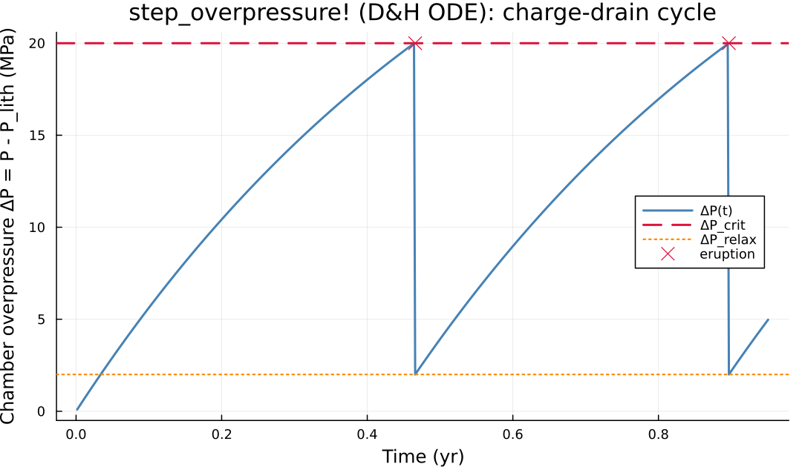

```@meta
CurrentModule = MagmaThermoKinematics
```

# Eruptions

`MagmaThermoKinematics.jl` can remove melt from the domain once a chamber becomes
eruptible. This is controlled through [`EruptionParams`](@ref) and driven by
[`erupt_magma!`](@ref) (wired into the 2D/3D time loop via the `MTK_erupt!`
callback). Two trigger models are available, selected with
`EruptionParams.overpressure`:

| Trigger | `overpressure` | Fires when | Withdrawal fraction `η` |
|:--------|:---------------|:-----------|:-------------------------|
| **Kinematic** (default) | `false` | eruptible volume $V_e \geq$ `V_crit` | fixed `erupt_efficiency` |
| **Physical** (D&H 2014) | `true`  | chamber overpressure $\Delta P \geq$ `ΔP_crit` | emergent, volume-conserving |

Both triggers share the same withdrawal, deflation and tracer-freeze machinery
below; they only differ in *when* an eruption fires and *how much* of the
eruptible melt (`η`) it removes.

## Eruptible Volume

A cell is *eruptible* once its melt fraction exceeds a threshold `ϕ_erupt`
(mobile-magma cutoff, default 0.5). The eruptible volume is the melt-weighted
sum over those cells:

$$V_e = \sum_{\phi_{i} > \phi_{\text{erupt}}} \phi_i \, V_{\text{cell}} \tag{E1}$$

computed by [`eruptible_volume`](@ref). In 2D this is a per-unit-depth volume
(area, treated as if 1 m deep); in 3D it is a true volume. An optional depth
cap `EruptAbove` excludes deep background melt (e.g. host-rock partial melt at
the base of a hot geotherm) from counting as eruptible chamber.

## Kinematic Trigger (`V_e ≥ V_crit`)

An eruption fires once $V_e \geq$ `V_crit`, and removes a **fixed** fraction
`η = erupt_efficiency` of the eruptible melt every time it fires. In 2D, `V_e`
is first lifted to a true 3D volume (assuming a Gaussian out-of-plane melt
distribution) so it is comparable, in km³, to `V_crit` and the injected
volume — see `EruptionParams.out_of_plane_3D`.

## Physical Trigger (`ΔP ≥ ΔP_crit`)

The physical trigger implements the lumped chamber-overpressure model of
[Degruyter & Huber (2014)](related_work.md) [6], as also used by the 1D
QMagma inversion code, so that eruption *timing* is directly comparable
between a 1D column and a 2D/3D MTK run. It replaces the fixed `V_crit`/`η`
pair with a mechanical/thermodynamic balance that is integrated every
timestep by [`step_overpressure!`](@ref) and drains only when the chamber
wall actually fails.

### Governing equation

The chamber overpressure $\Delta P = P - P_{\text{lith}}$ evolves as

$$\left(\frac{1}{\beta_r} + \frac{1}{\beta_m}\right)\frac{dP}{dt} =
\underbrace{\frac{\dot M_{\text{in}}}{\rho V_e}}_{\text{recharge}}
\;-\;
\underbrace{\frac{1}{\rho}\frac{d\rho}{dt}\bigg|_{T,\phi}}_{\text{crystallization}}
\;-\;
\underbrace{\frac{P - P_{\text{lith}}}{\eta_r}}_{\text{wall relaxation}}
\tag{E2}$$

| Symbol | Description |
|:-------|:------------|
| $P$, $P_{\text{lith}}$ | chamber pressure, lithostatic reference at the melt-weighted chamber centroid (Pa) |
| $\beta_r$ | host-rock (elastic shell) stiffness (Pa) — `EruptionParams.β_r` |
| $\beta_m$ | magma compressibility (Pa) |
| $\eta_r$ | wall relaxation viscosity (Pa·s) — `EruptionParams.η_r` |
| $\dot M_{\text{in}}$ | recharge mass rate (kg/s), from the injected-volume rate × `ρ_melt` |
| $\rho(T,\phi,P)$ | magma density — built via [`magma_density_fn`](@ref) from `EruptionParams.magma_phase`'s `Mat_tup` `Density` (and, for a `ThreePhase_Density`, `Solubility`) law |
| $V_e$ | eruptible volume (E1) |

The magma compressibility is obtained from the same density law by a finite
difference at fixed mush state,

$$\frac{1}{\beta_m} = \frac{1}{\rho}\frac{\partial \rho}{\partial P}\bigg|_{T,\phi} \tag{E3}$$

and the crystallization/second-boiling source is a finite difference against
the *previous* call's mush temperature and melt fraction, at fixed $P$:

$$\frac{d\rho}{dt}\bigg|_{T,\phi} \approx \frac{\rho(T_n,\phi_n,P) - \rho(T_{n-1},\phi_{n-1},P)}{\Delta t} \tag{E4}$$

!!! note "Second boiling needs a gas phase"
    With a plain melt+crystal density law (`ConstantDensity`,
    `MeltDependent_Density`, ...), no gas phase is modelled: plain
    crystallization ($\rho_{\text{solid}} > \rho_{\text{melt}}$) at fixed mass
    actually *depressurizes* a closed chamber, per the classical Blake/Tait
    result. Genuine second-boiling pressurization needs an exsolving
    low-density gas phase — give the `Mat_tup` entry `magma_phase` points to a
    `GeoParams.ThreePhase_Density` (melt+crystal+gas) `Density` law and a
    `Solubility` law (e.g. `Liu2005_Solubility`), and set
    `EruptionParams.m_h2o_total`; [`magma_density_fn`](@ref) then diagnoses
    the exsolved gas fraction each call from a quasi-equilibrium water mass
    balance, and $\rho(T,\phi,P)$ decreases on ascent/heating as water
    exsolves — see the `DegruyterHuber` examples. That `Density` law is also
    evaluated by the main thermal solver every cell/iteration (at
    `ϕ_gas=0`), so its `ρgas` law must stay finite everywhere —
    `IdealGas_Density`, not a narrow-range EOS like `RedlichKwong_Density`.

### Sub-stepping and drain

Recharge can pressurize the chamber far faster than the thermal timestep
$\Delta t$, so a single Euler step of (E2) can overshoot `ΔP_crit` and
over-book the erupted volume. Each call to `step_overpressure!` therefore
sub-divides $\Delta t$ so that $|\Delta P|$ moves by at most $\tfrac14
\Delta P_{\text{crit}}$ per sub-step. Whenever a sub-step crosses the failure
threshold, the chamber drains:

$$\Delta V_{\text{out}} = V_e \left(\Delta P - \Delta P_{\text{relax}}\right)\left(\frac{1}{\beta_r}+\frac{1}{\beta_m}\right), \qquad P \leftarrow P_{\text{lith}} + \Delta P_{\text{relax}} \tag{E5}$$

i.e. the drained volume is set by how much elastic+thermodynamic storage the
crossed overpressure represents — volume-conserving by construction, rather
than a tuned `erupt_efficiency`. `erupt_magma!` then uses $\eta =
\Delta V_{\text{out}} / V_e$ for the same thermal-withdrawal, deflation and
tracer-freeze steps the kinematic trigger uses (below).

The figure below drives `step_overpressure!` directly with a constant
synthetic recharge rate (constant density, so $1/\beta_m \equiv 0$) to show
the resulting charge → drain → relax sawtooth:



### Switching trigger models

Because both triggers live behind the same `EruptionParams` struct, switching
is a one-line change:

:::code-group

```julia [Kinematic (V_crit)]
Erupt = EruptionParams(
    erupt            = true,
    ϕ_erupt          = 0.5,
    V_crit_km3       = 10.0,
    erupt_efficiency = 0.5,
    deflate          = true,
)
```

```julia [Physical (ΔP_crit)]
Erupt = EruptionParams(
    erupt          = true,
    ϕ_erupt        = 0.5,
    overpressure   = true,
    magma_phase    = 2,        # Mat_tup phase whose Density/Solubility drive the ODE
    ΔP_crit        = 20e6,
    β_r            = 1e10,
    η_r            = 1e19,
    ρ_melt         = 2400.0,
    deflate        = true,
)
```

:::

`magma_phase` selects the `Mat_tup` entry (by `Phase`, matching what's passed
to `MTK_GeoParams_2D`/`_3D`) whose `Density` law `MTK_erupt!` uses to build the
$\rho(T,\phi,P)$ callback in (E2)–(E4) via [`magma_density_fn`](@ref); it is
required when `overpressure = true`.

## Withdrawal, Deflation and Cargo

Once `η` is known (fixed for the kinematic trigger, emergent for the physical
one), `erupt_magma!` performs the same steps regardless of trigger:

1. **Thermal extraction.** Each eruptible cell is cooled by
   $\Delta T = \eta\,\phi / (\partial \phi/\partial T)$ — the linearized
   temperature drop that removes a fraction $\eta$ of its melt — clamped at
   `T_min` so a flat melt curve ($\partial\phi/\partial T \to 0$) cannot drive
   $T$ to an unphysical value.
2. **Tracer freeze ("zircon cargo").** A random fraction $\eta$ of tracers in
   eruptible cells is frozen (their Tt-path stops being updated) *before* any
   deflation advection, preserving the eruption-instant position and history.
3. **Deflation (optional, `deflate=true`).** The chamber subsides by a
   volume-conserving field, model selected by `EruptionParams.deflation_model`:
   `:column` (default) — *column subsidence*: the host rock in each column
   sinks (purely vertically) by the melt void $\sum_z \eta\,\phi\,\Delta z$
   withdrawn beneath it, $O(N_{\text{grid}})$, no elastic parameters, but no
   lateral coupling between columns. `:local_mogi` — one Mogi-shaped kernel
   per eruptible cell, horizontally cutoff-bounded (`O(N_{\text{eruptible}}
   \times K)$), rescaled to the same exact volume — smoother, and tracks an
   irregular melt distribution the way independent columns cannot. Either way
   the surface-subsidence integral $\sum (z_{\text{surf}} -
   z_{\text{surf},0})\,\mathrm{d}A$ equals the booked erupted volume $\eta V_e$
   exactly. If a free surface is active, the same field lowers `FS.z_surf` —
   see [Free Surface](free_surface.md) for the two models compared side by side.
4. **Bookkeeping.** `n_eruptions`, `erupted_volume`, `eruption_times` and
   `eruption_volumes` are updated on `EruptionParams`.

## Full Example Files

Four self-contained scripts demonstrate both trigger models, in increasing
complexity — each is runnable as-is from the repository root
(`julia --project=. examples/<name>.jl`):

- [`MTK_GMG_2D_Eruption_Kinematic.jl`](https://github.com/boriskaus/MagmaThermoKinematics.jl/blob/main/examples/MTK_GMG_2D_Eruption_Kinematic.jl) — 2D, kinematic `V_crit` trigger (the baseline).
- [`MTK_GMG_2D_Eruption_DegruyterHuber.jl`](https://github.com/boriskaus/MagmaThermoKinematics.jl/blob/main/examples/MTK_GMG_2D_Eruption_DegruyterHuber.jl) — same 2D setup, physical `ΔP_crit` trigger. Diff it against the kinematic script above to see exactly what changes.
- [`MTK_GMG_3D_Eruption_DegruyterHuber_FlatTopo.jl`](https://github.com/boriskaus/MagmaThermoKinematics.jl/blob/main/examples/MTK_GMG_3D_Eruption_DegruyterHuber_FlatTopo.jl) — 3D, physical trigger, flat initial free-surface topography.
- [`MTK_GMG_3D_Eruption_DegruyterHuber_Lanin.jl`](https://github.com/boriskaus/MagmaThermoKinematics.jl/blob/main/examples/MTK_GMG_3D_Eruption_DegruyterHuber_Lanin.jl) — 3D, physical trigger, real downloaded topography (Lanin volcano). Requires the `GMT` package and internet access on the first run (caches the topography afterward); not run as part of this package's test/doc suite.

All four use deliberately soft `β_r`/`η_r` demo values (see the code comments)
so the physical trigger fires within a short run — calibrate them for any
real application.

## Reference

[6] Degruyter, W., and Huber, C. (2014). A model for eruption frequency of
upper crustal silicic magma chambers. Earth and Planetary Science Letters,
403, 117-130. https://doi.org/10.1016/j.epsl.2014.06.047
