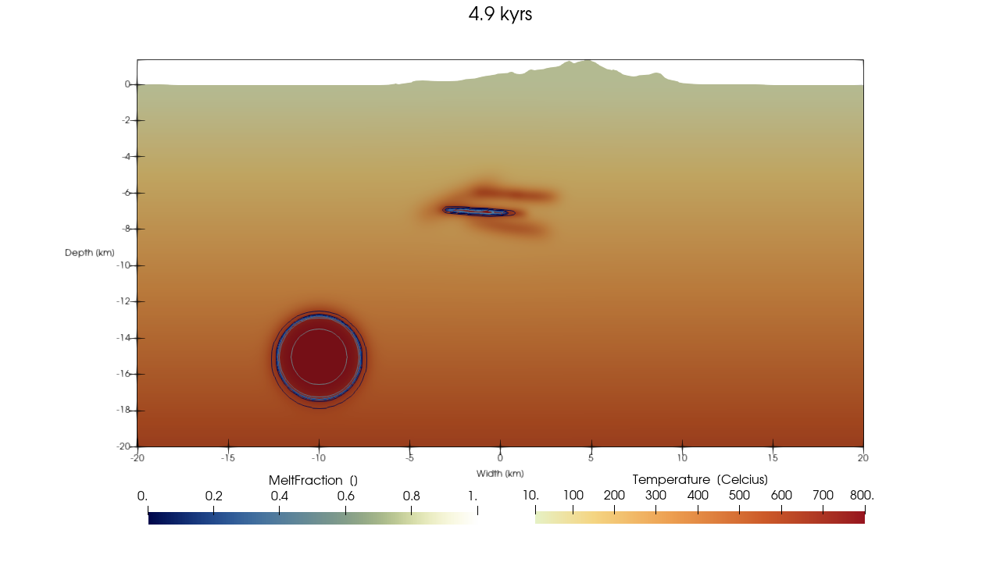

# MTK_GMG Example 2 (Unzen)

This page documents the coding style used in [examples/MTK_GMG_2D_example2.jl](https://github.com/boriskaus/MagmaThermoKinematics.jl/blob/main/examples/MTK_GMG_2D_example2.jl), to simulate the magmatic system beneath the Unzen volcano.

## GPU / CPU Selection

At the very top of the script, before any other `using` statements, you must declare whether to run on the GPU or CPU:

```julia
const USE_GPU = false     # set to true to run on an NVIDIA GPU
if USE_GPU
    using CUDA
end
using ParallelStencil, ParallelStencil.FiniteDifferences2D
using MagmaThermoKinematics

@static if USE_GPU
    environment!(:gpu, Float64, 2)
    CUDA.device!(0)                      # select the GPU (0-indexed)
    @init_parallel_stencil(CUDA, Float64, 2)
else
    environment!(:cpu, Float64, 2)
    @init_parallel_stencil(Threads, Float64, 2)
end

using MagmaThermoKinematics.Diffusion2D  # must be loaded AFTER environment!()
using MagmaThermoKinematics.Fields2D
using MagmaThermoKinematics.MTK_GMG_2D
```

`USE_GPU` must be a `const` so that `@static if` branches are resolved at compile time.  The `environment!` call and `@init_parallel_stencil` must come before any solver code is loaded.

## GeophysicalModelGenerator-Driven Setup

We start with loading the topography of a region, creating a 3D model setup:
```julia
# NOTE: topography preparation is typically done once and loaded from file
#  see the GeophysicalModelGenerator docs on how to compute this for an arbitrary place
Topo_cart = load_GMG("Topo_cart")

X,Y,Z       = xyz_grid(-23:.1:23,-19:.1:19,-20:.1:5)
Data_set3D  = CartData(X,Y,Z,(Phases=zeros(Int64,size(X)),Temp=zeros(size(X))))
```
Note that the 3D dataset should have `Phases` and `Temp` as arrays.


Next, we create a 2D cross-section through this 3D model with a specified resolution:
```julia
Nx = 135*6
Nz = 135*4
Data_2D = cross_section(Data_set3D, Start=(-20,4), End=(20,4), dims=(Nx, Nz))
Data_2D = addfield(Data_2D, "FlatCrossSection", flatten_cross_section(Data_2D))
Data_2D = addfield(Data_2D, "Phases", Int64.(Data_2D.fields.Phases))
```

You can add topography with this. Everything above the topography is set to `Phases=0`.
```julia
Below = below_surface(Data_2D, Topo_cart)
Data_2D.fields.Phases[Below] .= 1
@views Data_2D.fields.Phases[Data_2D.z.val .< -30.0] .= 2
```

## Material Parameters

Material properties for each phase are defined with `SetMaterialParams` from GeoParams.  The `MatParam` tuple must have one entry per phase, with phases numbered from 0.  Phase 0 is conventionally used for air/above-topography cells.

```julia
MatParam = (
    SetMaterialParams(Name="Air", Phase=0,
        Density      = ConstantDensity(ρ=2700kg/m^3),
        LatentHeat   = ConstantLatentHeat(Q_L=0.0J/kg),
        Conductivity = ConstantConductivity(k=3Watt/K/m),
        HeatCapacity = ConstantHeatCapacity(Cp=1000J/kg/K),
        Melting      = SmoothMelting(MeltingParam_4thOrder())),
    SetMaterialParams(Name="Crust", Phase=1,
        Density      = ConstantDensity(ρ=2700kg/m^3),
        LatentHeat   = ConstantLatentHeat(Q_L=3.13e5J/kg),
        Conductivity = T_Conductivity_Whittington_parameterised(),
        HeatCapacity = ConstantHeatCapacity(Cp=1000J/kg/K),
        Melting      = SmoothMelting(MeltingParam_4thOrder())),
    SetMaterialParams(Name="Mantle", Phase=2,
        Density      = ConstantDensity(ρ=2700kg/m^3),
        LatentHeat   = ConstantLatentHeat(Q_L=3.13e5J/kg),
        Conductivity = T_Conductivity_Whittington_parameterised(),
        HeatCapacity = ConstantHeatCapacity(Cp=1000J/kg/K)),
    SetMaterialParams(Name="Dikes", Phase=3,
        Density      = ConstantDensity(ρ=2700kg/m^3),
        LatentHeat   = ConstantLatentHeat(Q_L=3.13e5J/kg),
        Conductivity = T_Conductivity_Whittington_parameterised(),
        HeatCapacity = ConstantHeatCapacity(Cp=1000J/kg/K),
        Melting      = SmoothMelting(MeltingParam_4thOrder())),
)
```

Key choices in this setup:
- **Melting** — `SmoothMelting(MeltingParam_4thOrder())` uses the Marxer & Ulmer parameterisation wrapped in a smoothing function to ensure a continuous $\partial\phi/\partial T$ (required for numerical stability; see [Numerics](numerics.md)).
- **Conductivity** — `T_Conductivity_Whittington_parameterised()` provides a temperature-dependent conductivity for rock; air uses a constant value.
- **Latent heat** — set to zero for the air phase since no melting occurs above the topography.
- **DikePhase** — the `DikeParam` below uses `DikePhase=3`, so injected material is assigned the "Dikes" material properties.

See the [GeoParams parameterisations](MeltingParameterisations.md) page for all available options.

## Time-Dependent Diagnostics Hook
We specify a few custom time-dependent properties with:
```julia
@with_kw mutable struct TimeDepProps1 <: TimeDependentProperties
    Time_vec::Vector{Float64}       = []
    MeltFraction::Vector{Float64}   = []
    Tav_magma::Vector{Float64}      = []
    Tmax::Vector{Float64}           = []
    Tmax_1::Vector{Float64}         = []
end

function MTK_GMG.MTK_update_TimeDepProps!(time_props::TimeDependentProperties, Grid::GridData, Num::NumericalParameters, Arrays::NamedTuple, Mat_tup::Tuple, Dikes::DikeParameters)
    push!(time_props.Time_vec, Num.time)
    push!(time_props.MeltFraction, sum(Arrays.ϕ)/(Num.Nx*Num.Nz))
    push!(time_props.Tmax, maximum(Arrays.T))
    return nothing
end
```

## Parameter Setup and Run

The numerical parameters are set with:
```julia
Num = NumParam(
    SimName             = "Unzen1",
    dim                 = 2,
    maxTime_Myrs        = 0.005,
    SaveOutput_steps    = 25,
    CreateFig_steps     = 5,
    USE_GPU             = USE_GPU,
    ω                   = 0.5,
    AddRandomSills      = true,
    RandomSills_timestep= 5,
)
```
Note that the resolution is taken from the size of the `Data_2D` array.
Dike parameters are set with:
```julia
Dike_params = DikeParam(
    Type                   = "ElasticDike",
    InjectionInterval_year = 1000,
    W_in                   = 5e3,
    H_in                   = 250,
    H_ran                  = 5000,
    W_ran                  = 5000,
    nTr_dike               = 2000,
    Dip_ran                = 45,
    DikePhase              = 3,
    SillsAbove             = -10e3,
)
```

Finally, run the simulation with:
```julia
Grid, Arrays, Tracers, Dikes, time_props = MTK_GeoParams_2D(
    MatParam,
    Num,
    Dike_params,
    CartData_input = Data_2D,
    time_props     = TimeDepProps1(),
)
```

The `USE_GPU` flag passed to `NumParam` must match the `environment!` call at the top of the script.

## Full Example File
The result of the simulation looks like this:


Note that this file is generated with Paraview, and contains statefile info such that you can reproduce it on Paraview 6.1 or newer.

The complete, runnable script is available at
[`examples/MTK_GMG_2D_example2.jl`](https://github.com/boriskaus/MagmaThermoKinematics.jl/blob/main/examples/MTK_GMG_2D_example2.jl).

