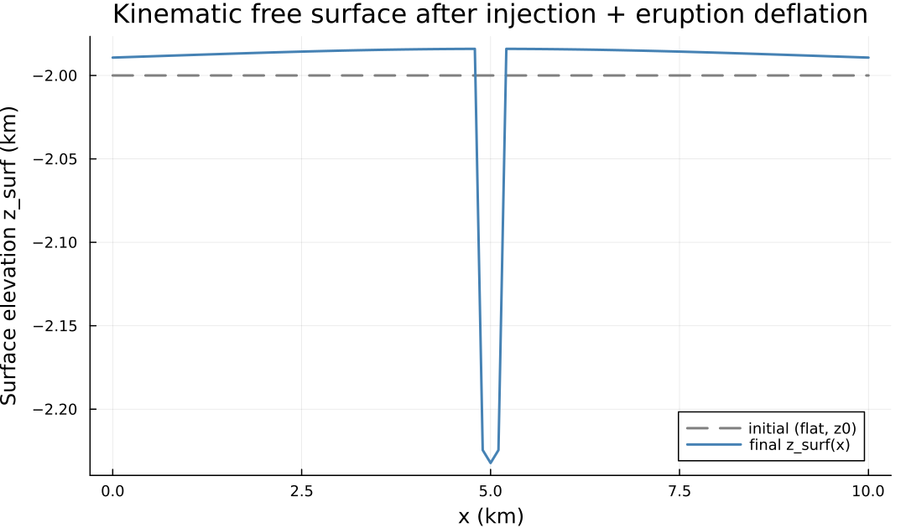
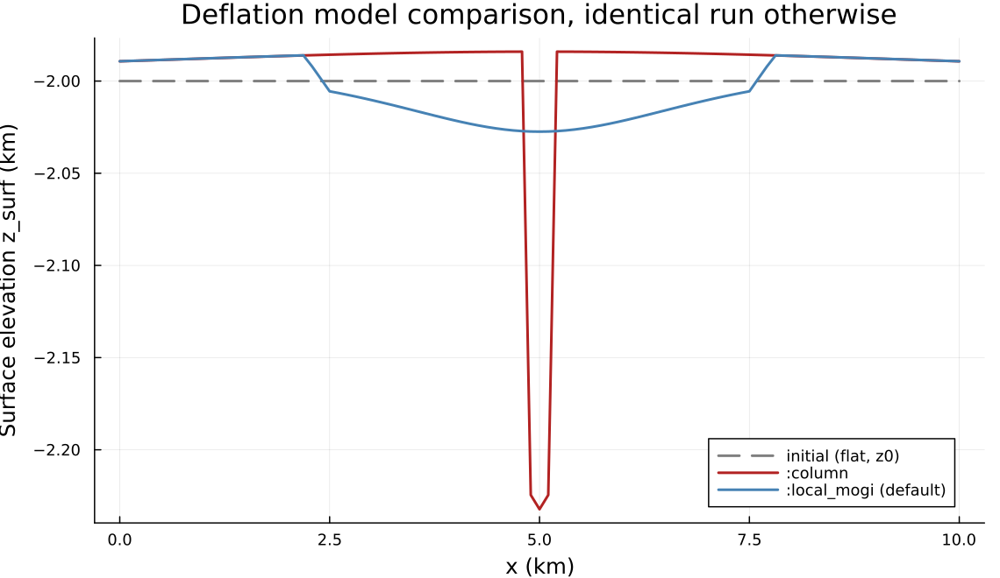
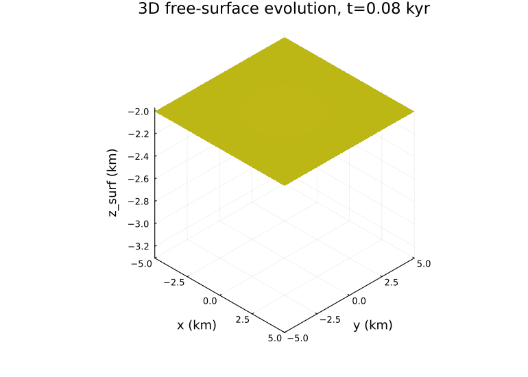
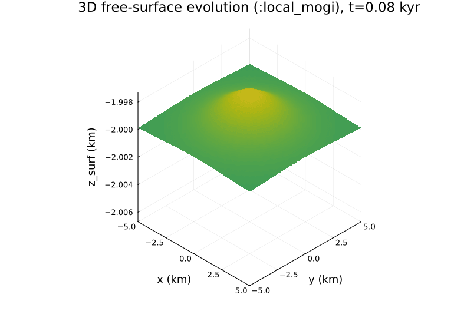

```@meta
CurrentModule = MagmaThermoKinematics
```

# Free Surface

`MagmaThermoKinematics.jl` can track a kinematic "sticky-air" free surface on
top of the model domain, so that sill injection and eruptive withdrawal
actually deform the ground surface instead of the domain top staying flat.
This is controlled through [`FreeSurfaceParams`](@ref) and driven by the
`MTK_free_surface!` callback (injection inflation + air stamping) together
with [`erupt_magma!`](@ref) (eruption deflation) — both wired into the
2D/3D time loop automatically when `FS.free_surface = true`.

## Topography Representation

The surface is stored as a one-elevation-per-column array `z_surf` (length
`Nx` in 2D, `Nx×Ny` in 3D), allocated on the first step from either a flat
elevation `z0` or a user-supplied `topography` (an array or a function
`f(x)`/`f(x,y)`) via [`init_free_surface`](@ref). Cells above `z_surf` are
stamped as "air" (`Tair`, zero melt fraction, `air_phase`) by
[`apply_free_surface!`](@ref); cells below keep the host-rock/sill phase they
already had.

## Inflation and Deflation

Both processes reuse the same host-rock displacement fields the interior
solver already computes — the surface is simply *advected* by them, via
[`advect_surface!`](@ref):

- **Inflation.** Each time a new sill is injected, its `hostrock_displacement`
  vertical component raises `z_surf` by the same field that pushed host rock
  and tracers aside in the interior (`InjectSills.jl`'s elastic/kinematic
  opening solution).
- **Deflation.** When `EruptionParams.deflate = true`, a volume-conserving
  field withdraws melt (see [Eruptions](eruptions.md)) and lowers `z_surf` by
  the same displacement applied to the interior. Two models, selected by
  `EruptionParams.deflation_model`:
  - `:column` (default) — each column sinks by exactly the melt void opened
    beneath it, with **no lateral coupling between columns**. `O(N_grid)`,
    volume-exact to machine precision, but the topography exactly mirrors the
    withdrawal mask, sharp edges included — see the note below.
  - `:local_mogi` — one Mogi-shaped kernel per eruptible cell (radially
    decaying, like the injection field above), evaluated over its full
    vertical reach but only within `deflation_cutoff_factor × depth` cells
    *horizontally*, capped at `deflation_max_window_cells` independently of
    grid resolution. That cap bounds the cost at `O(N_eruptible × K)`, with
    `K` the horizontal window width. The summed field is rescaled so the
    surface integral equals the withdrawn volume exactly, as for `:column`.
    It is smoother, and tracks an irregular melt distribution the way
    `:column`'s independent columns cannot; in exchange `ΔP`, `G` and `ν` act
    as shape parameters only, because a Mogi source expressing a realistic
    chamber volume change at crustal `G` and `ν` requires either
    $\Delta P \approx G/(3(1-\nu))$ — of order GPa — or a source radius
    larger than the model domain. See
    [`_local_mogi_deflation_velocity`](@ref).

When a free surface is active, `Num.deform_hostrock` is automatically forced
to `true` so the phase field is advected by the same displacements rather
than pinned — otherwise the phase interface would desync from the
continuously-advected `z_surf`.

The figures and animations below are produced by the scripts in
`docs/generate_figures/`. Their parameters are chosen to make the mechanism
visible in a sub-minute run and are not calibrated to any natural system:
read the shapes, not the magnitudes.

The first shows a short 2D run's final topography (`Nx=97`, a 300 m
half-width, 100 m thick sill at 5 km depth, 5 injection +
eruption-deflation cycles, `deflation_model = :column`) against the initial
flat surface:



!!! note "Why the pit is flat-bottomed and vertical-walled (`:column`)"
    The run re-injects one *fixed-location* sill repeatedly (5 injections,
    5 eruptions, all at the same footprint) with a low `V_crit`, so the same
    columns drain over and over. Column subsidence has **no lateral elastic
    communication between columns** — each sinks by exactly the melt void
    opened beneath it, independently, which is what makes it `O(N_grid)` and
    volume-exact instead of an elastic solve. Draining the same narrow
    footprint repeatedly therefore carves a deep, boxy pit with a sharp edge
    at the eruptible-region boundary, not a smooth collapse bowl. Injection
    uplift, by contrast, uses `InjectSills`' spatially-smooth elastic
    displacement field, hence the shallow dome on either side.

The same run with `deflation_model = :local_mogi` (the package default)
instead — everything else identical — replaces that deep, boxy pit with a
shallower, smooth, shape-tracking collapse:



The same mechanics apply unchanged in 3D, where `z_surf` is a full `Nx×Ny`
height field rather than a 1D profile. The animation below evolves a
`PennyShapedSill` (`Nx=Ny=Nz=41`, sill at 6 km depth, 500 m radius,
`deflation_model = :column`) through repeated injection + eruption-deflation
cycles, tracking the resulting dome — ~11 m of net uplift over 2.4 kyr at
these parameters:



The identical run with `deflation_model = :local_mogi` (the package default):
the collapse spreads smoothly around each injection site rather than only
where `:column`'s independent columns sit below eruptible melt. Deflation
reaches further per event, so the net elevation change differs from the
`:column` run above; the two models distribute the same withdrawn volume
differently.



## Mass-Budget Conservation Diagnostic

If the host-rock displacement that opens sills and deflates the chamber
conserves volume, the net magma added underground should equal the volume
swept by the moving ground surface:

$$V_{\text{injected}} - V_{\text{erupted}} \;\overset{?}{=}\; \sum_i \left(z_{\text{surf},i} - z_{\text{surf},0,i}\right)\, dA \tag{F1}$$

with $dA = \Delta x$ in 2D (per-unit-depth) and $dA = \Delta x\, \Delta y$ in
3D. [`mass_budget`](@ref) evaluates the right-hand side and returns

```julia
(; injected, erupted, Δsurface, residual, rel_residual) =
    mass_budget(Dikes.InjectVol, Erupt.erupted_volume, FS.z_surf, FS.z0, Grid)
```

where `residual = injected - erupted - Δsurface`. **The residual is a
like-for-like conservation error only in 3D** — in 2D, `injected`/`erupted`
are already-lifted 3D volumes (see the kinematic trigger in
[Eruptions](eruptions.md)) while `Δsurface` is a per-unit-depth area, so the
two are not dimensionally comparable; use a 3D run to test conservation
properly. `mass_budget` is a
*diagnostic*, not a corrective remap — a nonzero residual quantifies how far
the current kinematic displacement fields are from being volume-conserving
(e.g. a half-space source used on a free surface only expresses half its
volume at the surface), not an error the solver corrects for you.

## Enthalpy Diagnostic

A companion diagnostic, [`enthalpy`](@ref), integrates the domain's thermal energy

$$H = \sum_i \rho_i \left(C_{p,i} T_i + L_i \phi_i\right) V_{\text{cell},i} \tag{F2}$$

Snapshotting $H$ before/after an injection or eruption call isolates the numerical energy drift from advecting $T$ *intensively* (rather than conservatively) with the kinematic displacement fields, independent of the intended physical change from injecting hot magma or withdrawing melt.

## Minimal Setup

:::code-group

```julia [Flat surface]
FS = FreeSurfaceParams(
    free_surface = true,
    air_phase    = 0,
    Tair         = 0.0,
    z0           = -2.0e3,   # initial flat elevation [m]
)
```

```julia [Custom topography]
FS = FreeSurfaceParams(
    free_surface = true,
    air_phase    = 0,
    Tair         = 0.0,
    topography   = x -> -2.0e3 + 500.0*sin(2π*x/5e3),   # f(x) in 2D, f(x,y) in 3D
)
```

:::

Phase 0 (or whichever `air_phase` you pick) must have valid material
properties in `Mat_tup`, since air cells are still advanced by the diffusion
solver.

## Full Example Files

The [Eruptions](eruptions.md#full-example-files) page's 4-script series all
exercise the free surface: `MTK_GMG_2D_Eruption_Kinematic.jl` and
`MTK_GMG_2D_Eruption_DegruyterHuber.jl` (2D, flat initial surface),
`MTK_GMG_3D_Eruption_DegruyterHuber_FlatTopo.jl` (3D, flat initial surface).
`MTK_GMG_3D_Eruption_DegruyterHuber_Lanin.jl` represents its real downloaded
topography differently — via `CartData_input` (a DEM-derived phase/temperature
grid, phase 0 = air above the terrain) rather than the `FreeSurfaceParams`
`z_surf`-array tracker — with `deform_hostrock = true` so the air/rock
interface still evolves as sills inject and eruptions deflate the chamber.
